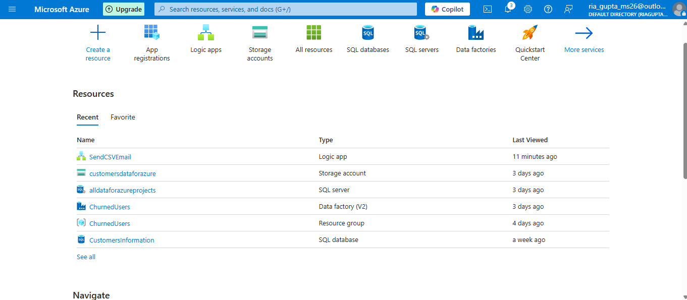
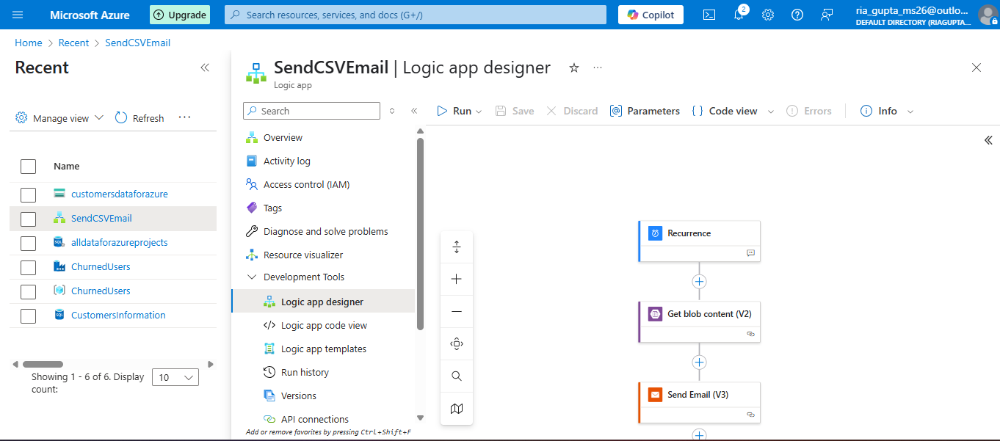
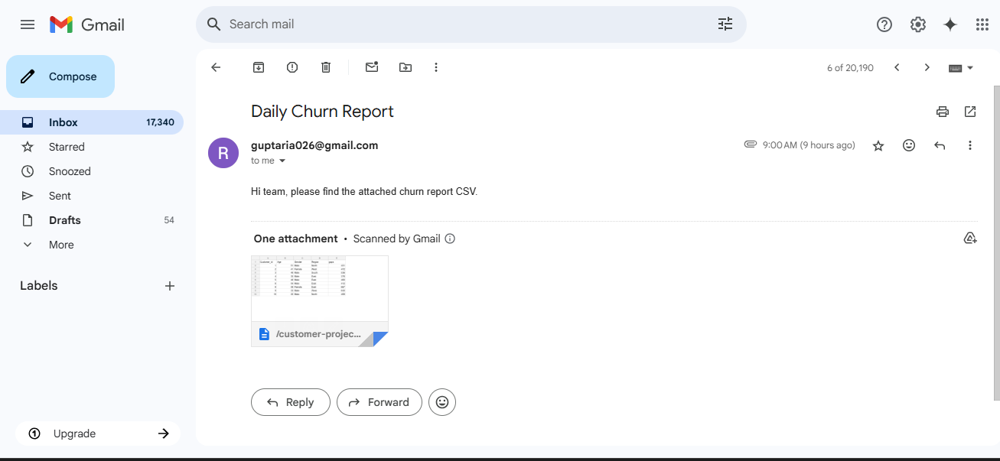

# Customer-Behaviour-Analysis
Case Study : As a data analyst/data engineer working for a BPO company , 
- I was responsible to figure out the login behaviour of every customer to know customer retention , to segment customer data which will help the company to know what are the 
  possible bands which are concerning and feared churning.  
- I was responsible for building an automated, scalable Customer Behavior & Churn Analysis pipeline using SQL and Azure which will help marketing teams stay updated. 

DataSet Overview : 
Tables Used: 
Logins: Contains user login history (Customer_ID, Login_Date) 
Customers: Contains demographic details (Age, Gender, Region) 
Purchase : Contains amount spend by each customer. 

🎯 Goals 
Cohort Analysis: Group users by their first login month and track retention monthly. 
Churn Detection: Identify users inactive for 30+ days. 
Export Churned Users: Create a pipeline to export churned customer IDs as CSV. 
Automation: Simulate a production-grade data pipeline with scheduling, monitoring, and email alerts. 

Question 1 : "How many customers have logged in more than once (returning customers) compared to those who logged in only once (one-time customers)?" 
Solution - Approach : (Go to Logins Table - find no of logins for each customer - count the no of logins if more than 1 then returning else one time) 
           SQL Query :  
           Step 1 - write a CTE to find no of logins  
           Step 2 - count the no of logins , if > 1 then returning else one time  

           WITH customerLogins AS(
          	SELECT
                  Customer_id AS Customer,
                  Count(*) AS NoOfLogins 
              FROM 
                  Logins
              GROUP BY
                  Customer_id         
          )
          SELECT Customer ,
                  CASE
                      WHEN NoOfLogins > 1 THEN 'Returning'
                      ELSE 'One time'
                  END AS STATUS
          FROM customerLogins 
          ORDER BY NoOfLogins ASC;

Question 2 : "How many days have passed since their last login?" 
Solution : Approach : (Go to logins table - find last login for each customer - find difference between today date and the last login date of each customer) 
           SQL Query : Step 1 - write a subquery to find last login date of each customer by using MAX() 
                       Step 2 - now select customer id and last date , find difference of last date and current date to find days , from this subquery 

          SELECT Last_Login,
          DATEDIFF(DAY,Last_Login,GETDATE()) AS days
          FROM (
              SELECT 
                MAX(Login_date) AS Last_Login,
                Customer_id
              FROM 
                Logins
              GROUP BY
                Customer_id
          ) AS customerLastLoginDate;

Question 3 : "How well are we retaining customers over time?" (Monthly Retention (Cohort Table)) 
             "Out of the customers who joined in the cohort month, what percentage are active in the current month?" 
Solution : Approach : find the cohort month (i.e first login month) for each customer  
                    - find all the activity months for each customer 
                    - now u have to find all distinct customers who have joined in a particular cohort month and were active in this particular activity month (customer may have logged                         in more than one time in the same month so we need distinct)
                    - caculate the retention percentage. 
           SQL Query : Step 1 - write a CTE to find cohort month (i.e first login month) for each customer 
                       Step 2 - write a CTE to find all the activity months for each customer 
                       Step 3 - write a CTE to find the cohort size from the 1st CTE 
                       Step 3 - now join these 3 CTEs on the basis of customer id so that for every customer , we have their cohort and all activity months and cohort month so 
                                we can get the cohort size 
                       Step 4 - group the data by cohort and activity month , find no of unique customers for the same  
                       Step 5 - find retention percentage by COUNT(DISTINCT a.Customer_id) * 100 / cs.Cohort_size 

           WITH customerCohortMonth AS (
              	SELECT MONTH(MIN(Login_date)) AS Cohort_month ,
              		   Customer_id
              	FROM   Logins
              	GROUP BY Customer_id
          ),
          customerActivityMonths AS (
              	SELECT Month(Login_date) AS Activity_Month ,
              		   Customer_id
              	FROM Logins
          ),
          cohortMonthSize AS(
              	SELECT Cohort_month,
              		   COUNT(DISTINCT Customer_id) AS Cohort_Size
              	FROM customerCohortMonth
              	GROUP BY Cohort_month 
          )
          
          SELECT c.Cohort_month ,
          	   a.Activity_Month,
          	   Count(DISTINCT a.Customer_id) AS total_activecustomers,
          	   ROUND(Count(DISTINCT a.Customer_id)*100/cs.Cohort_Size,2) AS rtn_Pct
          FROM customerCohortMonth AS c
          JOIN customerActivityMonths AS a
          ON c.Customer_id = a.Customer_id
          JOIN cohortMonthSize AS cs
          ON c.Cohort_month = cs.Cohort_month
          GROUP BY c.Cohort_month ,
          	   a.Activity_Month ,
          	   cs.Cohort_Size
          ORDER BY c.Cohort_month

Question 4 -  Which customer segments, based on demographic features (like gender, age group, or region),and high revenue generators have higher churn rates?”\
Solution : Approach : Determine a customer base , having customers who are more likely to be churned (eg. they must have minimum of 2 logins and last login > 30 days ago)\
                      Find out how many days have passed in between every consecutive login dates , flag them as 1 or 0 \
                      add their demographic details and expenditure details \
                      Segment the final output \
           SQL QUERY : - write a CTE to remove duplicate logins on same day ( so that we dont waste our time)\
                       - write a CTE to further filter the customer base by including only those customers who should have atleast 2 logins on different days or last login > 30 days ago\
                       - write to CTE to determine next logins using LEAD()\
                       - mark churn gaps\
                       - Join with purchase table (spend) + customer table (demographics)\
                       - Segment the result using NTILE() \

           
           WITH Login_base AS (
             SELECT DISTINCT Customer_id, Login_date 
             FROM Logins
           ),
           eligible_customers AS (
             SELECT Customer_id,
                    COUNT(*) AS num_logins,
                    MAX(Login_date) AS last_login
             FROM Login_base
             GROUP BY Customer_id
             HAVING COUNT(*) >= 2
                    OR (COUNT(*) = 1 AND DATEDIFF(DAY, MAX(Login_date), GETDATE()) >= 30)
           ),
           next_logins AS (
             SELECT lb.Customer_id,
                    lb.Login_date,
                    LEAD(lb.Login_date) OVER (PARTITION BY lb.Customer_id ORDER BY lb.Login_date) AS next_login
             FROM Login_base lb
             JOIN eligible_customers ec ON lb.Customer_id = ec.Customer_id
           ),
           
     
           churn_gaps AS (
             SELECT Customer_id,
                    Login_date,
                    next_login,
                    CASE
                      WHEN DATEDIFF(DAY, Login_date, next_login) >= 30 THEN 1
                      WHEN next_login IS NULL AND DATEDIFF(DAY, Login_date, GETDATE()) >= 30 THEN 1
                      ELSE 0
                    END AS churn_flag
             FROM next_logins
           ),
           
           churn_rate AS (
             SELECT
               c.Customer_id,
               SUM(p.Amount) AS total_spend,
               cu.Gender,
               cu.Age,
               cu.Region,
               ROUND(SUM(c.churn_flag) * 100.0 / COUNT(*), 2) AS churn_rate
             FROM churn_gaps c
             JOIN Customers cu ON cu.Customer_id = c.Customer_id
             JOIN Purchases p ON c.Customer_id = p.Customer_id
             GROUP BY c.Customer_id, cu.Gender, cu.Age, cu.Region
           )
           
           -- 6. Final output with segmentation
           SELECT
             NTILE(4) OVER (ORDER BY total_spend DESC) AS LTV_Band,
             Gender,
             Age,
             Region,
             COUNT(*) AS Total_Customers,
             ROUND(AVG(churn_rate), 2) AS Avg_Churn_Rate
           FROM churn_rate
           GROUP BY Gender, Age, Region, NTILE(4) OVER (ORDER BY total_spend DESC)
           ORDER BY Avg_Churn_Rate DESC;

Question 5 - End To End Pipeline - "Send the churned customers report (csv) via email" 
Solution - Used Azure To accomplish this task  
           - when i first entered on Azure platform , I created a data factory and a resource group with name "ChurnedUsers" 
           - Now I created a SQL server (as I decided to use Azure SQl Database) 
           - Azure SQL database - Cloud database to store my tables and use azure query editor to run my query. 
           - I used Azure data factory to orchaestrate , there i linked my azure sql server and database and a blob storage 
           - I created a storage account with name "customersdataforazure" and inside it i created a blob storage with name "CustomerBlob" on Azure platform 
           - In ADF , under Author , I created 2 Pipelines - LoadCSVtoSQL ( to load the data into azure SQL tables ) , ExportChurnedViewToBlob ( the churned view runs and export the                       churned view to blob )   
           - I created a Logic App with name SendCSVEmail with 3 activities - **Recurrence** - because i want a repeated activity ( send email every day at 9am) 
                                                                              **Get Blob Content** - to retrieve the churned report which is in the form of delimited text as CSV 
                                                                              **Send Email** - configure my smtp details here ( i used gmail through App password as gmail use 2 step                                                                                         verification) 
                                                                              
**Snapshot Of Resources** 

**Snapshot Of Logic App** 

**Snapshot Of Email Sent** 

                                                                             
            

          
